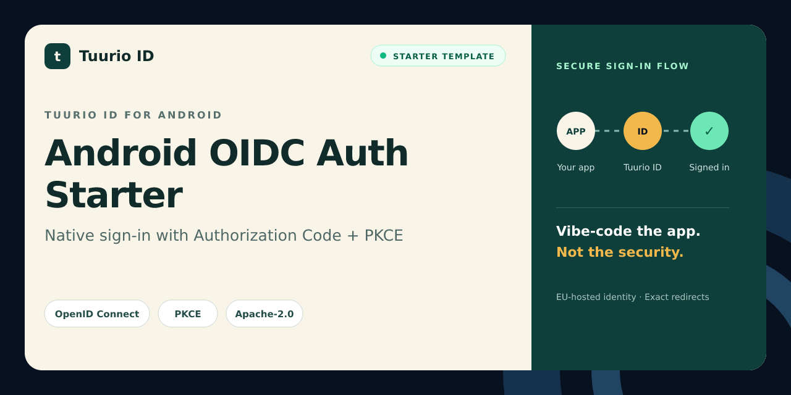

# Android OIDC Auth Starter

Android Jetpack Compose authentication starter for Tuurio ID using AppAuth, Authorization Code, PKCE, and native redirects.

[](https://github.com/Tuurio/android-oidc-auth-starter/actions/workflows/verify.yml)



> Generated from [`Tuurio/auth_samples/auth_samples_android`](https://github.com/Tuurio/auth_samples/tree/main/auth_samples_android). Submit implementation fixes upstream so they are not replaced by the next synchronized release.

## What you get

- Standards-based OpenID Connect authentication with framework-native integration.
- Exact redirect and post-logout redirect handling.
- Protected-route and logout examples.
- A reviewed, pinned Tuurio provisioning workflow.

## Quickstart

1. Create a repository with **Use this template** or clone this repository.
2. Follow the framework-specific prerequisites below.
3. Review and run this pinned provisioning command:

```bash
npx manage-tuurio-id@1.1.6 init --framework android --project-dir . --auth browser --yes --output json --campaign github_android --no-open --no-wait
```

4. Approve the exact command, then complete the secure browser handoff yourself.
5. Run the build and verify one real sign-in and sign-out.

Never paste credentials, client secrets, authorization codes, tokens, session cookies, or environment-file contents into an agent chat. Browser and native applications are public clients and must not contain a client secret.

## Runtime and verification

- Runtime: Android SDK 36 / Java 17+
- Package manager: Gradle Wrapper
- Verification: `./gradlew assembleDebug`

## Security model

This starter uses OpenID Connect Authorization Code flow. Browser and native clients use PKCE S256 and contain no client secret. Redirect and post-logout redirect URIs must match exactly. Identity comes from the established OIDC integration or an authenticated UserInfo request; decoded JWT payloads are never treated as validation. Keep generated local environment files ignored and never commit tokens or credentials.

## Framework instructions

# Tuurio Auth Android Demo

An Android (Jetpack Compose) demo that signs in with OAuth 2.0 / OpenID Connect, shows safe session metadata, and supports logout.

## Integration guide

- Detailed integration guide: [Android example page](https://id.tuurio.com/public/developers/examples/android)
- General developer docs: [Tuurio ID developers](https://id.tuurio.com/public/developers)

## What you need

- A client registered in your Tuurio account (from the id.tuurio.com dashboard).
- The Android redirect URI configured in that client.

Make sure the client has these URLs configured:

```
Redirect URI: com.example.app://oauth2redirect
Post-logout Redirect URI: http://localhost:5173/
```

## Setup

Open the project in Android Studio:

```
auth_samples_android
```

Then run the `app` configuration on an emulator or device.

## What you will see

- A login screen with a “Continue with Tuurio ID” button.
- After you authenticate, you are redirected back to the app.
- The app shows:
  - Token expiry time and scope without rendering token values.
  - UserInfo JSON (user profile).
  - Logout button that ends the session and returns to the app.

## Configuration

Edit `app/src/main/java/com/tuurio/authsample/auth/AuthConfig.kt` with the values from your **Connect** page:

```
https://<tenantId>.id.tuurio.com/admin/clients
```

Replace the placeholders with values for your own tenant and native client:

```
authorizeEndpoint: https://YOUR_TENANT.id.tuurio.com/oauth2/authorize
tokenEndpoint: https://YOUR_TENANT.id.tuurio.com/oauth2/token
clientId: YOUR_CLIENT_ID
redirectUri: com.example.app://oauth2redirect
scope: openid profile email
postLogoutRedirectUri: http://localhost:5173/
```

## Implemented snippet

The app mirrors your provided AppAuth snippet in `AuthRepository` and `AuthViewModel`, including:

- Building `AuthorizationServiceConfiguration` with authorize/token endpoints.
- Creating the `AuthorizationRequest` with PKCE and scope.
- Launching the authorization intent and exchanging the code for tokens.
- Fetching OIDC discovery for `end_session_endpoint` and starting RP-initiated logout.

## Notes

- Session state is stored in `SharedPreferences` to mimic the web demo’s session behavior.
- The redirect activity is wired in `AndroidManifest.xml` for `com.example.app://oauth2redirect`.

## URL scheme setup (required)

Ensure the redirect URI scheme in your app matches the client configuration.

Add the AppAuth redirect receiver to `app/src/main/AndroidManifest.xml`:

```xml
<activity
    android:name="net.openid.appauth.RedirectUriReceiverActivity"
    android:exported="true">
    <intent-filter>
        <action android:name="android.intent.action.VIEW" />
        <category android:name="android.intent.category.DEFAULT" />
        <category android:name="android.intent.category.BROWSABLE" />
        <data
            android:scheme="com.example.app"
            android:host="oauth2redirect" />
    </intent-filter>
</activity>
```

Also set the manifest placeholder (Android Gradle):

```gradle
defaultConfig {
  manifestPlaceholders = [ appAuthRedirectScheme: "com.example.app" ]
}
```

## Deep link checklist

Use the following checklist before testing login on a real device:

- The redirect URI in `AuthConfig.kt` and the redirect URI in your Tuurio client must match exactly.
- The `android:scheme` and `android:host` values in the manifest must match that redirect URI exactly.
- Test with one redirect receiver only. If your app has both a custom scheme handler and an App Link for the same auth flow, Android may resolve the redirect inconsistently.
- If you move from `com.example.app://oauth2redirect` to an HTTPS App Link, update both the client configuration and the manifest intent filters together.
- After changing redirect settings, uninstall and reinstall the app on the device to avoid stale intent handling.

## Troubleshooting

**Login hangs after returning from the browser**
- Verify the redirect URI matches exactly.
- Ensure the redirect URI intent filter uses the correct scheme + host.

**No matching state found**
- Confirm that the same app instance handles both the request and redirect.
- Avoid launching multiple auth flows in parallel.


## License

Licensed under the Apache License, Version 2.0. See [`LICENSE`](./LICENSE).
